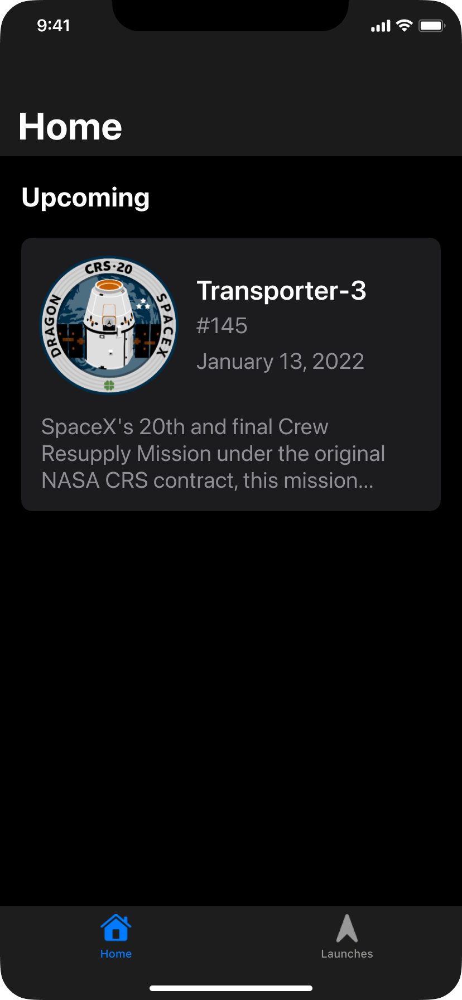
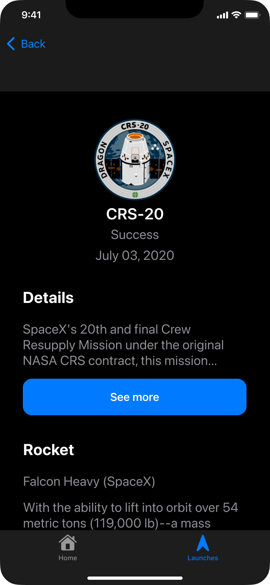
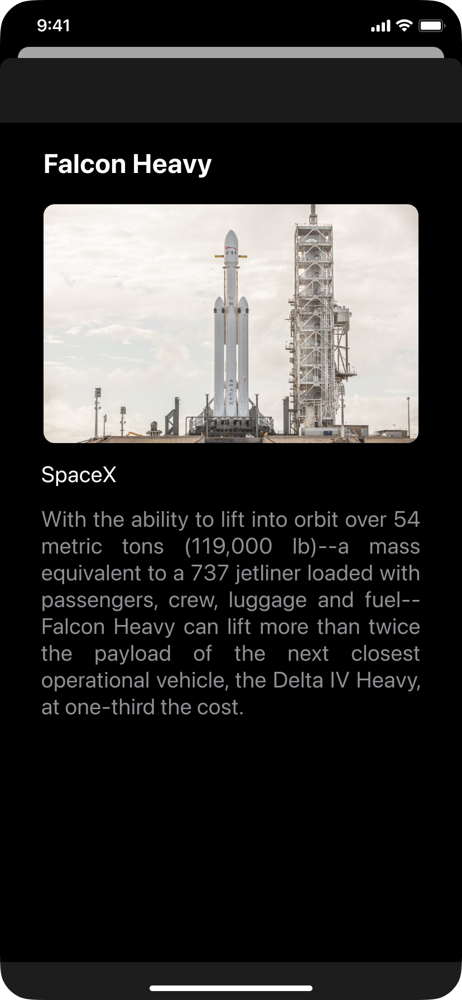

# SwiftUI Challenge - Space App 🚀

Neste desafio, desenvolveremos a interface de um aplicativo que mostra os próximos lançamentos da SpaceX em SwiftUI.

# Iniciando os trabalhos

1. Clone este repositório na sua máquina.
2. Abra a pasta `solutions` e acesse o projeto referente à sua Sprint.
3. Faça um build e rode o projeto. ▶️

# Sobre a Devpass

A Devpass é uma comunidade de pessoas desenvolvedoras de alto potencial acelerando suas carreiras através de desenvolvimento de produtos reais, como o Hereminders, e conexões com as principais lideranças de tecnologia do país, através de mentorias particulares e Tech Talks.

Se interessou? Acesse www.devpass.com.br e se inscreva na nossa lista para ficar por dentro das novidades!
